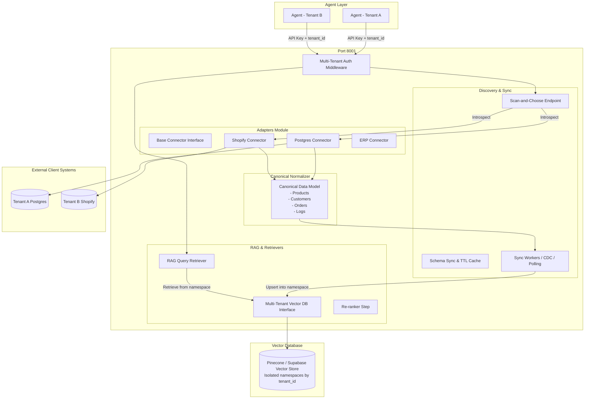

# Adapter-Hub Microservice

The **Adapter-Hub** is a standalone, multi-tenant integration and RAG microservice. It serves as the unified database/API connectivity and information retrieval layer for all AI agents, abstracting away custom connection configurations, introspecting tables/fields via a scan-and-choose interface, storing whitelists, and exposing namespace-isolated vector search (RAG) with keyword-boosted re-ranking.

---

## 1. High-Level System Architecture



---

## 2. Folder Structure

```
adapter_hub/
├── README.md                   # Architecture, strategies, and external API guide
├── requirements.txt            # Dependency definitions
├── main.py                     # FastAPI server and route controllers
├── config.py                   # Environment & symmetric key configuration
├── auth/
│   ├── __init__.py
│   ├── middleware.py           # Strict scoping middleware (X-Tenant-ID & X-Agent-ID checks)
│   └── secrets.py              # Encryption/decryption at rest (AES/Fernet) for credentials
├── adapters/
│   ├── __init__.py             # Factory helper for instantiation
│   ├── base.py                 # Abstract Base Class Connector interface
│   ├── canonical.py            # B2B Canonical Pydantic schemas (Product, Customer, Order, Log)
│   ├── postgres.py             # Introspective Postgres & SQLite adapter
│   ├── shopify.py              # Shopify Admin REST/GraphQL API adapter
│   └── erp.py                  # ERP template placeholder adapter
├── sync_workers/
│   ├── __init__.py
│   ├── schema_discovery.py     # Scan-and-choose registry, TTL schema cache
│   └── vector_sync.py          # Worker converting canonical entities into vector embeddings
├── rag_retrievers/
│   ├── __init__.py
│   ├── vector_db.py            # Multi-tenant vector store (Pinecone/Supabase simulator)
│   └── retriever.py            # Context search query endpoint with re-ranking logic
└── tests/
    ├── __init__.py
    └── test_vector_isolation.py # Automated isolation test suite
```

---

## 3. Base "Adapter" Connector Interface

All future integrations (e.g. HubSpot, Dynamics, Salesforce) must extend the abstract `Connector` base class in `adapter_hub/adapters/base.py`:

```python
from abc import ABC, abstractmethod
from typing import Any, Dict, List

class Connector(ABC):
    def __init__(self, config: Dict[str, Any], tenant_id: str, agent_id: str):
        self.config = config
        self.tenant_id = tenant_id
        self.agent_id = agent_id

    @abstractmethod
    async def test_connection(self) -> bool:
        """Verify credential connectivity. Returns True or raises ConnectionError."""
        pass

    @abstractmethod
    async def discover_schema(self) -> List[Dict[str, Any]]:
        """Introspect tables, fields, columns, and types from client database/API."""
        pass

    @abstractmethod
    async def sync_data(self, whitelist: Dict[str, Any]) -> List[Any]:
        """Fetch, normalize, and return data mapped to Canonical schemas."""
        pass
```

---

## 4. API Rate-Limiting & Error-Handling Strategy

### Rate-Limiting
To prevent third-party integrations from rate-limiting or blocking our agents, the Adapter-Hub applies a **Redis Token Bucket algorithm** mapped at the `tenant_id` + `provider` composite key level:
* Calls to source integrations are cached whenever possible (e.g., schema structural data cached with a 5-minute TTL).
* Outbound API limits are configured globally or per tenant. If a tenant hits 80% of Shopify's limit, a wait/back-off schedule is automatically introduced.

### Error Handling
The hub uses standardized API response formats. Instead of returning raw SQL stack traces, it returns client-friendly JSON errors:
* `CONNECTOR_AUTH_ERROR`: Bad credentials/expired token.
* `RATE_LIMIT_EXCEEDED`: Third-party or Adapter-Hub threshold triggered.
* `INTEGRATION_TIMEOUT`: Remote systems taking >15 seconds.
* `SCHEMA_MISMATCH`: Target column deleted or modified on client side.

---

## 5. API Integration Guide for External Agents

AI agents or external programs communicate with the Adapter-Hub by supplying three headers on every request:
1. `X-API-Key`: The Master/Admin key (configured via `ADAPTER_HUB_MASTER_KEY`).
2. `X-Tenant-ID`: The client identifier (e.g. `tenant_a`).
3. `X-Agent-ID`: The specific agent identifier (e.g. `sdr_bot_v2`).

### Endpoint 1: Register Third-Party Credentials
Saves and encrypts credentials for the tenant's adapter.

* **URL**: `/connections/register`
* **Method**: `POST`
* **Payload**:
```json
{
  "provider": "postgres",
  "config": {
    "host": "database-host.com",
    "port": 5432,
    "database": "sales_records",
    "username": "read_only_user",
    "password": "supersecretpassword123"
  }
}
```

### Endpoint 2: Scan-and-Choose Schema Discovery
Performs introspective scan of client systems. Returns available tables/columns. Results are cached (TTL = 5 minutes).

* **URL**: `/schema/discover?bypass_cache=false`
* **Method**: `GET`
* **Response Example**:
```json
{
  "ok": true,
  "schema": [
    {
      "name": "catalog_items",
      "columns": [
        {"name": "sku_code", "type": "varchar"},
        {"name": "item_title", "type": "varchar"},
        {"name": "unit_cost", "type": "numeric"}
      ]
    }
  ]
}
```

### Endpoint 3: Register Field Whitelist
Specifies what tables and fields should be synced to the Vector Database.

* **URL**: `/schema/whitelist`
* **Method**: `POST`
* **Payload**:
```json
{
  "whitelist": {
    "products": {
      "table": "catalog_items",
      "columns": {
        "id": "sku_code",
        "name": "item_title",
        "price": "unit_cost"
      }
    }
  }
}
```

### Endpoint 4: Trigger Vector DB Synchronization
Performs the ETL: extracts whitelisted data, formats to canonical models, generates embeddings, and pushes them to the tenant-isolated space in the Vector DB.

* **URL**: `/sync`
* **Method**: `POST`
* **Response**:
```json
{
  "ok": true,
  "synchronized_count": 12,
  "message": "Successfully synced 12 canonical records."
}
```

### Endpoint 5: Multi-Tenant RAG Retrieve (Context Search)
Retrieve relevant canonical context for a prompt.

* **URL**: `/retrieve`
* **Method**: `POST`
* **Payload**:
```json
{
  "query": "Looking for heavy duty valves",
  "top_k": 3,
  "min_score": 0.1
}
```

---

## 6. How to Use in External Python Agents

Here is a clean implementation demonstrating how an external agent queries the hub for isolated RAG retrieval:

```python
import httpx
import asyncio

HUB_URL = "http://localhost:8001"
HEADERS = {
    "X-API-Key": "adapter-hub-super-secret-key",
    "X-Tenant-ID": "client_alpha_co",
    "X-Agent-ID": "lead_enricher_bot"
}

async def fetch_isolated_context(user_query: str):
    async with httpx.AsyncClient() as client:
        # Retrieve context from isolated tenant space
        resp = await client.post(
            f"{HUB_URL}/retrieve",
            headers=HEADERS,
            json={
                "query": user_query,
                "top_k": 3,
                "min_score": 0.1
            }
        )
        resp.raise_for_status()
        data = resp.json()
        
        # Format retrieval context for LLM prompt
        context_snippets = []
        for result in data.get("results", []):
            context_snippets.append(f"Source [{result['entity_type']}]: {result['text']}")
            
        return "\n".join(context_snippets)

async def main():
    context = await fetch_isolated_context("valve stock level")
    print("Isolated Context for Agent:\n", context)

if __name__ == "__main__":
    asyncio.run(main())
```
