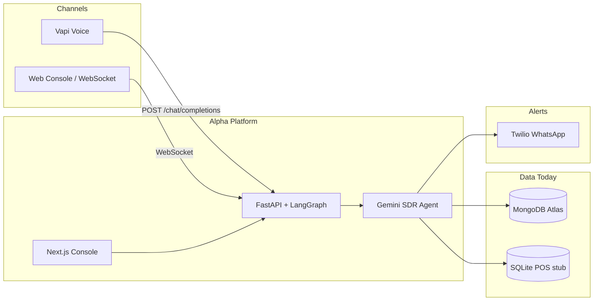
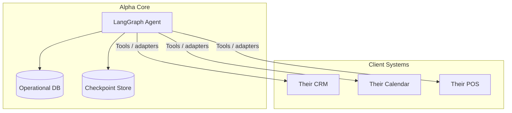
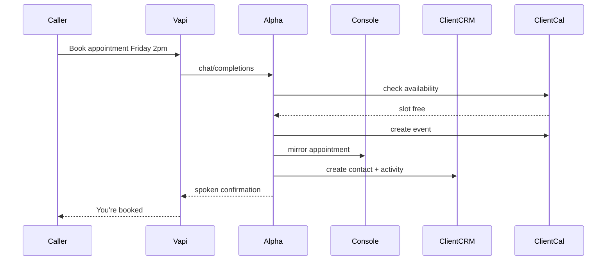
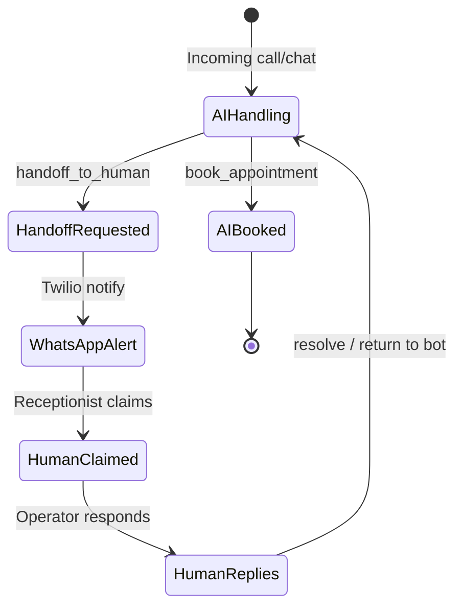

# Alpha — Client Onboarding & Integration Playbook

This document describes how to onboard Alpha (B2B SDR Agent Console) to production clients: deployment, data architecture, POS/calendar/CRM integrations, human receptionist workflows, and common client scenarios.

---

## What you have today (baseline)



| Layer | Today | Client-ready? |
|---|---|---|
| Voice | Vapi custom LLM → your backend | Yes — per client needs own Vapi assistant |
| Chat sandbox | WebSocket + console | Yes for demo/pilot |
| CRM data | MongoDB (`leads`, `conversations`) | Yes — single-tenant today |
| Appointments | MongoDB `appointments` | Yes — internal only |
| Orders | MongoDB + SQLite POS | Demo / intake only |
| POS | Local SQLite with seeded products | Not a real POS |
| Human handoff | WhatsApp alert + Supervisor UI | Partial — claim/resolve APIs need restoration |
| Agent memory | LangGraph checkpoints in MongoDB | Hard dependency on Mongo today |

---

## Client onboarding: 5 phases

### Phase 0 — Pre-sales discovery (1–2 calls)

Collect this intake form for every client:

**Business**
- Industry, products/services, pricing model (subscription, one-time, quote-based)
- Who answers the phone today? (receptionist, sales rep, owner)
- What should the AI do vs what must always go to a human?

**Systems inventory**
- CRM: HubSpot / Salesforce / Pipedrive / spreadsheets / none
- Calendar: Google Calendar / Outlook / Calendly / front-desk software
- POS / inventory: Shopify / Square / Lightspeed / custom ERP / none
- Phone: existing number, call routing, business hours
- Database: Postgres / MySQL / Mongo / unknown

**Compliance**
- PII handling, recording consent, HIPAA/PCI if relevant
- Who owns call recordings and transcripts?

**Success criteria**
- e.g. “Book 20 demos/month”, “Answer 80% of product questions”, “Never miss after-hours calls”

**Deliverable:** Integration map — one page showing which systems connect and which stay manual in v1.

---

### Phase 1 — Pilot setup (1–2 weeks)

Goal: one client, one use case, minimal integrations.

**Checklist**

1. **Deploy isolated stack per client** (recommended for first clients)
   - Backend: Render / Railway / Fly / AWS
   - Frontend: Vercel
   - DB: MongoDB Atlas cluster (or dedicated DB name)
   - Env vars: `MONGODB_URI`, `GEMINI_API_KEY`, `VAPI_*`, `TWILIO_*`

2. **Create client API key** in MongoDB `api_keys` (today: manual seed; production: admin UI)

3. **Configure Vapi assistant**
   - Custom LLM URL → `https://{client-backend}/chat/completions`
   - Voice, greeting, business name in system prompt
   - Phone number or web widget

4. **Customize agent prompt** (`backend/agent/graph.py` → `SYSTEM_PROMPT`)
   - Their products, packages, policies
   - Hours, escalation rules

5. **Branding**
   - Console title/logo in `frontend/app/layout.tsx`
   - Optional white-label subdomain: `alpha.client.com`

6. **Train receptionist on console**
   - Sandbox tab: test chat
   - Supervisor tab: handoffs
   - Appointments / Orders tabs: operational view

**Pilot scope (pick one)**
- After-hours voice receptionist
- Appointment booking only
- Product Q&A + order intake (no payment)

---

### Phase 2 — Integrations (2–6 weeks)

This is where “Postgres instead of Mongo” and POS questions get answered.

---

## Database strategy: Mongo vs Postgres vs anything else

### What MongoDB is used for today

| Use | Collection | Why Mongo today |
|---|---|---|
| Leads / CRM | `leads` | Flexible schema |
| Chat history | `conversations` | Append messages |
| Appointments | `appointments` | Simple documents |
| Orders | `orders` | Simple documents |
| API keys | `api_keys` | Auth |
| **Agent memory** | `checkpoints`, `writes` | **LangGraph MongoDBSaver — hard dependency** |

### Recommended architecture for mixed client stacks



**Rule of thumb**

| Client has | Recommendation |
|---|---|
| Nothing / greenfield | Keep Mongo for Alpha ops + checkpoints (fastest) |
| Postgres only, no Mongo | Postgres for ops data; small Mongo **or** Postgres checkpointer for LangGraph memory |
| Postgres + existing CRM | Alpha writes to CRM via API tools; Alpha DB is cache/audit log |
| Strict “no Mongo” policy | Repository layer + Postgres checkpointer; ~2–4 week eng effort |

**Do not** point the agent directly at client production Postgres on day one. Use an adapter layer:

```
Agent Tool → Alpha Service → Client DB/API
```

That gives validation, logging, rate limits, and rollback.

---

## How clients “look at the same data”

Offer **three visibility tiers**:

### Tier A — Alpha Console (built today)
- Leads, appointments, orders, live chat, supervisor queue
- Best for: receptionist / small team
- Limitation: not their CRM of record

### Tier B — Sync to their CRM (production target)
- On `place_order`, `book_appointment`, `handoff_to_human` → webhook or API push to HubSpot/Salesforce
- They work in tools they already use
- Alpha console becomes backup / ops view

### Tier C — Read from their systems (enterprise)
- Agent tools query **their** calendar for availability
- Agent tools query **their** POS for stock
- Alpha DB stores conversation audit + thread IDs only



**Source of truth**

| Data | Pilot | Production |
|---|---|---|
| Appointments | Alpha Mongo | Client calendar |
| Orders | Alpha Mongo + SQLite stub | Client POS/ERP |
| Leads | Alpha Mongo | Client CRM |
| Conversations | Alpha Mongo | Alpha (compliance/audit) |

---

## POS systems: integration patterns

Today POS is a **local SQLite stub** (`backend/database.py` → `pos_database.db`).

### Pattern 1 — Read-only catalog
Agent answers price, stock, packages.  
Replace `query_pos_database` with Shopify/Square API adapter.

### Pattern 2 — Order intake (current model)
Agent collects order → writes to Alpha → syncs to POS/ERP. Human completes payment offline.

### Pattern 3 — Full commerce (hard)
Payment on call, inventory reservation, tax — requires PCI scope and POS write APIs.

| POS | Integration approach |
|---|---|
| Shopify | Admin API: products, draft orders |
| Square | Catalog API + Orders API |
| Lightspeed / Toast | Partner API or middleware |
| Custom ERP | REST/SQL adapter per client |
| Spreadsheet | Google Sheets / Airtable as MVP POS |

**Implementation shape**

```python
class POSAdapter(Protocol):
    async def list_products(self, query: str) -> list[Product]: ...
    async def create_order(self, order: OrderRequest) -> OrderResult: ...
    async def get_order_status(self, order_id, verify_email) -> str: ...
```

Swap `SQLitePOSAdapter` for `ShopifyPOSAdapter` per client via `POS_PROVIDER=shopify`.

---

## Appointments + human receptionist

### 1. AI books autonomously
- Tools: `book_appointment`, `cancel_appointment`, `reschedule_appointment`, `lookup_appointments`
- Good for: simple businesses, fixed hours

### 2. Human receptionist in the loop



**Production additions needed**

| Capability | Status | Notes |
|---|---|---|
| WhatsApp/SMS alert on handoff | Built | Configure per client |
| Supervisor console | Built (UI) | Restore claim/resolve APIs |
| Live call transfer (Vapi) | Not built | Warm transfer to human phone |
| Shared calendar | Not built | Google Calendar / Calendly adapter |
| Receptionist sees caller context | Partial | Show lead + transcript in supervisor |
| Business hours routing | Not built | After-hours AI; business hours → human |

### Appointment + receptionist (recommended production flow)

1. Availability from receptionist calendar (Google/Outlook), not hardcoded slots
2. AI books **tentative** hold → receptionist confirms
3. Or: AI **requests** appointment; receptionist confirms in console (lower risk for medical/legal)

---

## Voice vs chat vs WhatsApp

| Channel | Today | Client onboarding |
|---|---|---|
| Voice (Vapi) | Production-ready | 1 Vapi assistant per client |
| Web chat (console) | Demo / internal | Embed widget on client site |
| WhatsApp inbound | Alert only | Twilio WhatsApp as inbound channel |
| SMS | Not built | Twilio SMS for confirmations |

---

## Multi-tenant vs per-client deploy

### Option A — Per-client deploy (first 5–10 clients)
- Pros: isolation, simpler security, custom prompts/adapters
- Cons: more ops overhead

### Option B — Multi-tenant single deploy (scale later)
- Add `tenant_id` to every document
- API key → tenant mapping
- Row-level isolation in all queries

**Recommendation:** per-client deploy until 3+ clients are live.

---

## Environment & secrets per client

```env
# Core
MONGODB_URI=
DATABASE_NAME=salesagent_acme
GEMINI_API_KEY=

# Voice
VAPI_PUBLIC_KEY=
VAPI_PRIVATE_KEY=

# Alerts
TWILIO_ACCOUNT_SID=
TWILIO_AUTH_TOKEN=
TWILIO_WHATSAPP_TO=
ENABLE_WHATSAPP_ALERTS=true

# Future adapters
POS_PROVIDER=shopify
SHOPIFY_STORE=
SHOPIFY_TOKEN=
CALENDAR_PROVIDER=google
GOOGLE_CALENDAR_ID=
CRM_PROVIDER=hubspot
HUBSPOT_API_KEY=
```

Frontend:

```env
NEXT_PUBLIC_BACKEND_URL=
NEXT_PUBLIC_VAPI_PUBLIC_KEY=
NEXT_PUBLIC_VAPI_ASSISTANT_ID=
```

---

## Onboarding runbook (week-by-week)

| Week | You do | Client does |
|---|---|---|
| 1 | Discovery, integration map, deploy pilot | Product list, FAQs, hours, escalation rules |
| 2 | Customize prompt, Vapi, console branding | Receptionist tests 20 call scenarios |
| 3 | Connect calendar OR CRM (one integration) | UAT: book/cancel/reschedule/order flows |
| 4 | Soft launch (after-hours only) | Monitor console daily |
| 5–6 | Tune prompt from real calls, add POS read-only | Expand to business hours |

---

## Packaging for clients

| Tier | Includes | Typical buyer |
|---|---|---|
| **Starter** | Voice AI + console + appointments/orders in Alpha DB | SMB |
| **Professional** | + CRM sync + calendar + WhatsApp alerts | SMB with receptionist |
| **Enterprise** | + Custom POS/ERP + SSO + SLA + dedicated deploy | Mid-market |

---

## Gaps to fix before serious client onboarding

1. **Handoff claim/resolve API** — frontend references endpoints not in backend
2. **No admin UI for API keys / tenants**
3. **POS is simulated** — need adapter interface per client
4. **Appointments not synced to external calendar**
5. **No multi-tenant isolation**
6. **LangGraph checkpoints require Mongo** — Postgres-only clients need migration plan
7. **No call recording / transcript export**
8. **Single system prompt** — need per-client prompt config

---

## Decision tree: common client questions

**“We use Postgres, not Mongo”**
- Postgres for business data: yes (with adapter refactor)
- Eliminate Mongo entirely: only if LangGraph checkpointer is migrated
- Pragmatic: Postgres for client data; managed store for AI memory

**“We have Shopify”**
- Phase 1: read products from Shopify API
- Phase 2: create draft orders on `place_order`
- Phase 3: payment link SMS after call

**“Receptionist must approve appointments”**
- `book_appointment` → `status=pending`
- WhatsApp alert → console approve/deny → confirmation SMS

**“We already use HubSpot”**
- Alpha = voice layer; leads/deals sync to HubSpot
- Console optional for receptionist

**“We need HIPAA / PCI”**
- Dedicated deploy, BAA, no card data on calls, request-only bookings

---

## Recommended product roadmap

**Now (pre-client)**
- Restore handoff claim/resolve endpoints
- Per-client config (env or file-based prompt/products)
- Deployment runbook (this document)

**Next 30 days**
- `POSAdapter` + `CalendarAdapter` interfaces
- Google Calendar read/write
- HubSpot contact sync

**Next 60–90 days**
- Admin portal (API keys, prompt editor, integrations)
- Multi-tenant OR templated deploy automation
- Postgres repository option for operational data
- Embeddable web chat widget

---

## Collecting contact details during voice calls

When the caller uses the **web console** during a Vapi call, the agent can ask them to **type** name, email, or phone in the chat box for accuracy. The voice pipeline reads those typed messages from the linked chat thread.

**Flow**
1. User starts Vapi call from console → call linked to current chat thread
2. Agent: “For accuracy, please type your email in the chat box.”
3. User types in sandbox chat → saved via WebSocket
4. Next voice turn → backend merges typed chat into agent context
5. If user declines typing → agent accepts dictation but **reads back** and warns about speech-to-text errors (e.g. “one” vs “1”)

See implementation: `/api/voice/link`, `get_typed_chat_details` tool, console banner during active calls.

---

## Bottom line

- Onboard in phases: discovery → isolated pilot → one integration → go-live → expand
- Don’t replace Mongo on day one unless required; use **adapters** to client Postgres/CRM/POS
- Clients see data via: **console**, **CRM/calendar sync**, or **direct read** from their systems
- POS stays behind an adapter: read-only → order intake → payments only if needed
- Human receptionist = alerts + supervisor + calendar sync + optional live transfer
