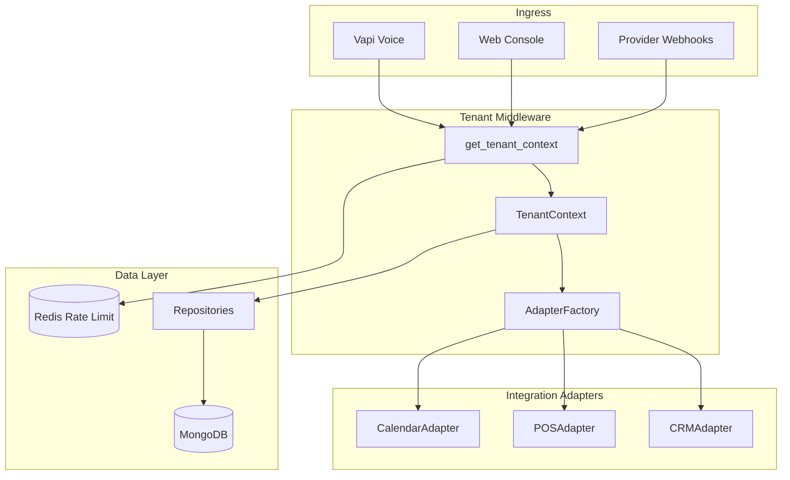

# Alpha Devs: Multi-Tenant Architecture Implementation Plan

This document is the **System Requirement Specification (SRS)** and **Implementation Roadmap** for moving Alpha from a single-tenant demo into a production-ready, multi-tenant B2B SaaS platform.

**Audience:** AI coding agents, junior developers, and architects implementing the refactor.

**Related:** [CLIENT_ONBOARDING.md](./CLIENT_ONBOARDING.md) — client-facing onboarding and integration patterns.

---

## Executive summary

The system shifts from a monolithic stub model to a **tenant-aware middleware model**. Logic is **decoupled** so you can onboard hundreds of clients without custom-coding each deployment.

**Build order (recommended):**

1. `TenantContext` + `get_tenant_context` middleware (bones)
2. Repository layer with mandatory `tenant_id` filtering (safety)
3. `AdapterFactory` + `Protocol` interfaces (plumbing)
4. First adapters: Google Calendar → Shopify POS → Zoho CRM
5. Admin control plane (Supabase auth, API keys, integration UI)
6. Agent pipeline: tenant prompts, Vapi metadata, webhooks

---

## 1. Core architecture design

The system will shift from a monolithic "stub" model to a **tenant-aware middleware model**.



### Database strategy (the foundation)

**Logical isolation:** All operational collections in MongoDB must include a `tenant_id` field and a compound index on `(tenant_id, …)`.

| Collection | Today | Multi-tenant |
|---|---|---|
| `leads` | global | `tenant_id` required |
| `conversations` | global | `tenant_id` required |
| `orders` | global | `tenant_id` required |
| `appointments` | global | `tenant_id` required |
| `voice_call_links` | global | `tenant_id` required |
| `api_keys` | global | migrate → `tenants` registry |
| `checkpoints` / `writes` | LangGraph | scope by `thread_id` prefix or tenant metadata |

**Tenant registry:** Master `tenants` collection:

```json
{
  "tenant_id": "org_acme_001",
  "org_name": "Acme Corp",
  "api_key_hash": "<bcrypt or sha256 of key>",
  "status": "active",
  "integration_configs": {
    "crm": { "provider": "zoho", "access_token_enc": "...", "refresh_token_enc": "..." },
    "pos": { "provider": "shopify", "shop_domain": "acme.myshopify.com", "token_enc": "..." },
    "calendar": { "provider": "google", "calendar_id": "...", "token_enc": "..." }
  },
  "settings": {
    "system_prompt": "...",
    "webhook_url": "https://client.com/hooks/alpha",
    "rate_limit_per_minute": 120,
    "products_catalog": []
  },
  "created_at": "ISO8601",
  "updated_at": "ISO8601"
}
```

**Secrets:** Never store integration tokens in plain text. Use `cryptography.fernet` with a server-side `ENCRYPTION_KEY` env var. Encrypt on write, decrypt only inside adapters.

**Postgres-only clients:** Operational data can live in Postgres per tenant via repository adapters; LangGraph checkpoints may still require Mongo or a Postgres checkpointer until migrated (see CLIENT_ONBOARDING.md).

### Backend: tenant middleware

**Dependency injection:** Every FastAPI endpoint depends on `get_tenant_context(x-api-key)` (or `Authorization: Bearer` during transition).

**Adapter factory:** Instantiate the correct `CRMAdapter`, `POSAdapter`, or `CalendarAdapter` from `TenantContext.integration_configs`.

**Repository pattern:** All DB access goes through repositories that **require** `tenant_id` — no raw `db.leads.find({})` in route handlers or tools.

---

## 2. Functional modules & implementation steps

### Module A: Admin & onboarding (control plane)

| Feature | Description |
|---|---|
| **Supabase Auth** | User sessions; `tenant_id` in JWT `app_metadata` |
| **API key management** | Generate, view, rotate keys; store hash only |
| **Integration UI** | Toggle-and-connect: Zoho OAuth, Shopify token, Google Calendar |
| **Connection handshake** | Test each integration before saving credentials |
| **Tenant prompt editor** | Edit `settings.system_prompt`; effective within ~30s |

**Trigger example:** Toggle "Zoho" → OAuth modal → store encrypted tokens in `tenants.integration_configs`.

### Module B: Integration adapter layer (plumbing)

**Defined protocols:** `backend/adapters/base.py` using `typing.Protocol`.

**First three adapters:**

1. **`ShopifyPOSAdapter`** — read products, create draft orders
2. **`ZohoCRMAdapter`** — sync leads, update deal status
3. **`GoogleCalendarAdapter`** — read availability, book slots

**Resiliency:** Every adapter method wrapped in try/except; log to central `logs` collection:

```json
{
  "tenant_id": "...",
  "provider": "zoho",
  "error_type": "HTTP401",
  "message": "...",
  "timestamp": "ISO8601",
  "context": { "tool": "sync_lead", "thread_id": "..." }
}
```

**Factory:**

```python
class AdapterFactory:
    @staticmethod
    def crm(ctx: TenantContext) -> CRMAdapter: ...
    @staticmethod
    def pos(ctx: TenantContext) -> POSAdapter: ...
    @staticmethod
    def calendar(ctx: TenantContext) -> CalendarAdapter: ...
```

Replace direct SQLite POS calls in `backend/agent/tools.py` with `AdapterFactory.pos(ctx)`.

### Module C: Agent execution pipeline

| Change | Detail |
|---|---|
| **Dynamic system prompt** | Fetch from `tenants.settings.system_prompt` at thread start; merge with base safety rules |
| **Tool context** | Pass `TenantContext` into LangGraph config: `configurable.tenant_id` |
| **Vapi metadata** | Always pass `tenant_id` + `console_thread_id` in call metadata |
| **Webhook router** | `POST /webhooks/{provider}` — validate signature, resolve tenant, route to adapter |

**LangGraph tools** must receive tenant context via `RunnableConfig` and use repositories + adapters only.

---

## 3. Edge cases & risk mitigation

| Edge case | Scenario | Mitigation |
|---|---|---|
| **Dead integrations** | Client changes Zoho password | Adapter returns 401; log to DB; email tenant admin |
| **API rate limits** | 500 calls/min on one tenant | Redis rate limit keyed by `tenant_id` |
| **Data leaks** | `tenant_id` omitted in query | Repository pattern; lint/test for raw collection access |
| **Cold starts** | New tenant misconfigured | Admin "Connection Handshake" before save |
| **Orphaned webhooks** | Vapi call without tenant | Require `tenant_id` in Vapi `metadata`; reject if missing in prod |
| **Adapter down** | Zoho API 503 | Tool returns graceful message; agent continues; no process crash |
| **Prompt cache staleness** | Admin updates prompt | TTL cache ≤30s or invalidate on tenant update |
| **Cross-tenant API key** | Key rotation mid-call | Old key grace period (e.g. 24h) with audit log |

---

## 4. AI-developer prompt template

Copy and paste into your AI coding agent to begin implementation:

```text
I am refactoring my Python/FastAPI backend to be multi-tenant. Please act as a Senior Software Architect.

Goal: Build a tenant-aware backend using the Repository Pattern.

Requirements:
1. Create a TenantContext class that holds the tenant_id and integration configurations.
2. Create a FastAPI dependency get_tenant_context that extracts the x-api-key header,
   validates it against a MongoDB tenants collection, and returns the context.
3. Define CRMAdapter, POSAdapter, and CalendarAdapter interfaces using typing.Protocol.
4. Create an AdapterFactory that returns the correct implementation based on TenantContext.
5. Ensure all database queries use a Repository pattern to automatically inject a tenant_id filter.

Security: Never store integration secrets in plain text. Provide a helper to encrypt/decrypt
sensitive fields using cryptography.fernet.

Task: Start by writing TenantContext, get_tenant_context, and the CRMAdapter protocol.
Then add LeadRepository with mandatory tenant_id scoping.
```

---

## 5. Success criteria for go-live

1. **Isolation test:** Client A cannot access Client B's data using their API key.
2. **Config test:** Changing `system_prompt` in Admin UI affects the next API call within 30 seconds.
3. **Resilience test:** If Zoho API is down, the agent continues (graceful tool failure) without crashing the process.
4. **Logging test:** Every handoff and order is logged in `logs` with `tenant_id`.
5. **Vapi test:** Voice call with metadata `{ tenant_id, console_thread_id }` resolves correct tenant and prompt.
6. **Rate limit test:** Exceeding tenant quota returns 429 without affecting other tenants.

---

## 6. Phased implementation roadmap

### Phase 0 — Preparation (1 week)

- [ ] Add `docs/MULTI_TENANT_ARCHITECTURE.md` (this file)
- [ ] Introduce `backend/tenant/` package skeleton
- [ ] Add `ENCRYPTION_KEY`, `REDIS_URL` to config
- [ ] Migration script: seed first tenant from existing `api_keys` + env prompt

### Phase 1 — Tenant bones (2 weeks) ← **START HERE**

- [ ] `TenantContext` dataclass
- [ ] `tenants` collection schema + indexes
- [ ] `get_tenant_context` FastAPI dependency (replace `validate_api_key_in_db`)
- [ ] `secrets.py` — Fernet encrypt/decrypt helpers
- [ ] `LeadRepository`, `ConversationRepository` with forced `tenant_id`
- [ ] Refactor 3 endpoints: `/api/leads`, `/api/conversations`, `/api/orders`

### Phase 2 — Adapter layer (2–3 weeks)

- [ ] `Protocol` definitions in `backend/adapters/base.py`
- [ ] `AdapterFactory`
- [ ] `StubPOSAdapter` (current SQLite behavior, tenant-scoped)
- [ ] `GoogleCalendarAdapter` (highest client demand)
- [ ] `ShopifyPOSAdapter`
- [ ] `ZohoCRMAdapter`
- [ ] Refactor agent tools to use factory

### Phase 3 — Agent & voice (1–2 weeks)

- [ ] Dynamic `SYSTEM_PROMPT` from tenant settings
- [ ] LangGraph config: `tenant_id` in checkpointer thread namespace
- [ ] Vapi: enforce `metadata.tenant_id`
- [ ] Central `logs` collection + structured adapter errors

### Phase 4 — Control plane (2–3 weeks)

- [ ] Supabase Auth + JWT `tenant_id`
- [ ] Admin UI: API keys, integrations, prompt editor
- [ ] OAuth flows: Zoho, Google
- [ ] Connection handshake tests
- [ ] Redis rate limiting middleware

### Phase 5 — Hardening & launch (1–2 weeks)

- [ ] Isolation + resilience test suite
- [ ] Migrate existing Render deploy to tenant `alpha_internal`
- [ ] Documentation update in CLIENT_ONBOARDING.md
- [ ] Runbook for new tenant provisioning

---

## 7. File structure (target)

```
backend/
  tenant/
    context.py          # TenantContext
    middleware.py       # get_tenant_context
    secrets.py          # Fernet helpers
  repositories/
    base.py             # TenantScopedRepository
    leads.py
    conversations.py
    orders.py
    appointments.py
  adapters/
    base.py             # Protocol definitions
    factory.py          # AdapterFactory
    stub_pos.py
    shopify_pos.py
    zoho_crm.py
    google_calendar.py
  agent/
    graph.py            # fetch prompt from TenantContext
    tools.py            # use AdapterFactory + repositories
  webhooks/
    router.py           # /webhooks/{provider}
```

---

## 8. Migration from current codebase

| Current | Target |
|---|---|
| `api_keys` collection | `tenants.api_key_hash` |
| `validate_api_key` in `main.py` | `get_tenant_context` |
| Direct `db.leads.find` in `database.py` | `LeadRepository.list(tenant_id)` |
| SQLite POS in tools | `StubPOSAdapter` → `ShopifyPOSAdapter` |
| Static `SYSTEM_PROMPT` in `graph.py` | `tenant.settings.system_prompt` + base rules |
| `save_lead(thread_id, …)` | `LeadRepository.upsert(tenant_id, thread_id, …)` |
| Vapi link by `call_id` only | Link includes `tenant_id` |

**Backward compatibility:** During Phase 1, accept legacy `test_key_abc123` mapped to a default tenant until all clients migrate.

---

## 9. First module to implement

**Recommendation: Module 1 — `TenantContext` + middleware + one repository.**

Do **not** start with the Admin UI or OAuth. The bones are:

1. `TenantContext`
2. `get_tenant_context`
3. `LeadRepository` (proves the pattern)
4. Wire `/api/leads` to use them

Then add `AdapterFactory` with `StubPOSAdapter` that wraps existing SQLite logic.

This order prevents building UI on top of a non-tenant-safe data layer.

---

## 10. Open decisions (resolve before Phase 2)

| Decision | Options |
|---|---|
| Checkpointer isolation | Per-tenant DB name vs `tenant_id` in thread_id prefix |
| Admin app location | Separate Next.js app vs `/admin` routes in current frontend |
| Billing / quotas | Stripe metered vs manual tier flags on `tenants` |
| Single vs multi-region | One Mongo cluster with tenant_id vs cluster per enterprise client |

---

## Appendix: Environment variables (production)

```env
# Existing
MONGODB_URI=
DATABASE_NAME=salesagent
GEMINI_API_KEY=

# Multi-tenant
ENCRYPTION_KEY=          # Fernet key (generate once, store in secrets manager)
REDIS_URL=               # Rate limiting
SUPABASE_URL=
SUPABASE_SERVICE_KEY=

# Optional per-tenant defaults (override in tenants collection)
DEFAULT_SYSTEM_PROMPT=
```

Generate Fernet key:

```bash
python -c "from cryptography.fernet import Fernet; print(Fernet.generate_key().decode())"
```
